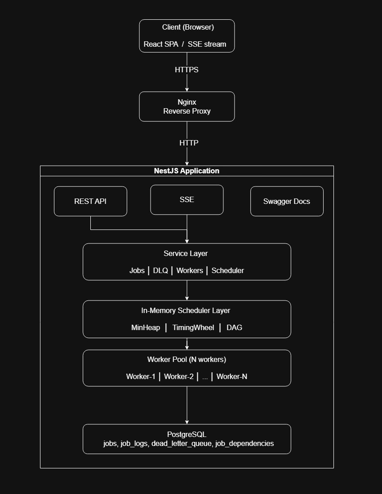

# Background Job Scheduler — Architecture Document

## Table of Contents

1. [System Overview](#system-overview)
2. [Technology Stack](#technology-stack)
3. [High-Level Architecture](#high-level-architecture)
4. [Backend Module Breakdown](#backend-module-breakdown)
5. [Heap-Based Priority Queue](#heap-based-priority-queue)
6. [Alternative Scheduling Algorithm — Timing Wheel](#alternative-scheduling-algorithm--timing-wheel)
7. [Algorithm Benchmark](#algorithm-benchmark)
8. [Worker Pool & Job Execution](#worker-pool--job-execution)
9. [Job Lifecycle & State Machine](#job-lifecycle--state-machine)
10. [Retry Logic & Backoff Strategy](#retry-logic--backoff-strategy)
11. [Dead Letter Queue (DLQ)](#dead-letter-queue-dlq)
12. [DAG Workflow & Job Dependencies](#dag-workflow--job-dependencies)
13. [Starvation Prevention & Aging](#starvation-prevention--aging)
14. [Duplicate Protection](#duplicate-protection)
15. [Scheduled & Recurring Jobs](#scheduled--recurring-jobs)
16. [Cancellation Behaviour](#cancellation-behaviour)
17. [Server-Sent Events (SSE)](#server-sent-events-sse)
18. [Logging](#logging)
19. [Database Schema](#database-schema)
20. [Deployment Architecture](#deployment-architecture)
21. [Configuration Reference](#configuration-reference)

---

## System Overview

The Background Job Scheduler is a full-stack system that creates, queues, processes, and tracks asynchronous background jobs. It is designed to handle failure automatically, prevent starvation of low-priority jobs, support DAG-based job dependencies, and expose a live UI that reflects system state in real time without page refreshes.

The backend is built with **NestJS** (Node.js / TypeScript), persists state to **PostgreSQL** via **TypeORM**, and runs workers as independent in-process loops that poll a shared in-memory priority queue. The frontend is a **React + Vite** SPA that connects to the backend over REST and SSE.

---

## Technology Stack

| Layer | Technology |
|---|---|
| Backend Framework | NestJS 11 (TypeScript) |
| Database | PostgreSQL 16 |
| ORM | TypeORM 0.3 |
| Process Manager | PM2 (fork mode) |
| Reverse Proxy | Nginx |
| Email Delivery | Resend SDK (mocked in dev) |
| Frontend | React 19 + Vite 8 |
| Frontend Routing | React Router DOM 7 |
| Frontend Flow Graph | ReactFlow 11 |
| Logging | Winston |
| Runtime | Node.js 20 |

**Why PM2 fork mode (not cluster)?**
The in-memory Min-Heap and Timing Wheel are shared state within a single Node.js process. Running PM2 in cluster mode would spawn multiple processes, each with their own heap copy, causing duplicate job dispatches and race conditions. Fork mode keeps a single process with the shared heap intact while still providing auto-restart and process management.

---

## High-Level Architecture



---

## Backend Module Breakdown

The NestJS application is organised into the following modules:

| Module | Responsibility |
|---|---|
| `AppModule` | Root module, wires all feature modules |
| `DatabaseModule` | TypeORM async connection setup |
| `LoggingModule` | Global Winston logger service |
| `JobsModule` | CRUD for jobs, creation pipeline, DAG wiring |
| `SchedulerModule` | Global: MinHeap, TimingWheel, DAG, SchedulerService |
| `WorkersModule` | Global: WorkerPoolService, Worker instances |
| `HandlersModule` | Global: HandlerRegistry, EmailHandler |
| `DlqModule` | Dead Letter Queue CRUD + retry logic |
| `SseModule` | Global: SSE subject streams for live UI |
| `MetricsModule` | Aggregate metrics endpoint + periodic broadcast |
| `BenchmarkModule` | Job seeding + algorithm benchmarking |

All `@Global()` modules (Scheduler, Workers, Handlers, SSE, Logging) are injected across feature modules without explicit imports, keeping the dependency graph clean.

---

## Heap-Based Priority Queue

### Data Structure

The scheduler uses a **binary min-heap** (`MinHeap` class in `src/scheduler/heap/min-heap.ts`) backed by a flat array with an accompanying `Map<id, index>` for O(1) lookups by job ID.

### Ordering Criteria

Jobs are extracted from the heap in this priority order:

1. **Effective Priority** (lower number = higher urgency): `1 = High`, `2 = Medium`, `3 = Low`
2. **Scheduled Time**: among jobs with the same effective priority, those scheduled sooner are extracted first. Immediate jobs (no `scheduledAt`) always beat scheduled ones.
3. **Creation Time** (FIFO tiebreaker): among jobs with identical priority and schedule, the oldest job wins.

```
compare(a, b):
  if both have scheduledAt → sort by scheduledAt ASC
  if only a has scheduledAt → b wins (a is deferred)
  if only b has scheduledAt → a wins (b is deferred)
  sort by effectivePriority ASC
  tiebreak by createdAt ASC
```

### Operations & Complexity

| Operation | Complexity |
|---|---|
| `insert(item)` | O(log n) |
| `extractMin()` | O(log n) |
| `peek()` | O(1) |
| `remove(id)` | O(log n) via idMap lookup |
| `update(id, delta)` | O(log n) — bubbleUp + sinkDown |

### Heap Hydration

On `onModuleInit`, `JobHeapService` queries PostgreSQL for all `PENDING` jobs and inserts them into the heap, skipping any that have unresolved dependencies or a future `scheduledAt` (those go to the Timing Wheel instead). This ensures the heap survives application restarts without losing queued work.

---

## Alternative Scheduling Algorithm — Timing Wheel

### Design

The Timing Wheel is a **hierarchical two-level wheel** modelled on the classic Hashed Timing Wheel described by Varghese & Lauck (1987):

- **Level 1 — Seconds Wheel**: 60 slots, one slot per second. Current slot advances on every 1-second tick.
- **Level 2 — Minutes Wheel**: 60 slots, one slot per minute. Jobs scheduled more than 60 seconds ahead are placed here.

```
Seconds Wheel  [0][1][2]...[59]
                ↑
          currentIndex advances each tick

Minutes Wheel  [0][1][2]...[59]
                ↑
          currentIndex advances every 60 ticks
```

### Job Placement

When a job is scheduled with a future `scheduledAt`:

```
delaySeconds = (scheduledAt - now) / 1000

if delaySeconds < 60:
    slot = (secondsWheel.currentIndex + delaySeconds) % 60
    secondsWheel.slots[slot].add(job)
else:
    delayMinutes = floor(delaySeconds / 60)
    minutesWheel.slots[(minutesWheel.currentIndex + delayMinutes) % 60].add(job)
```

### Tick Behaviour

Every second the ticker fires:
1. Advance the seconds wheel, collect mature jobs → push to MinHeap immediately.
2. Every 60 seconds, advance the minutes wheel, collect mature minute-level jobs → re-slot them into the seconds wheel at the correct remaining-seconds offset.

### Benchmark Comparison

See [Algorithm Benchmark](#algorithm-benchmark) section.

---

## Algorithm Benchmark

The `POST /api/v1/benchmark` endpoint seeds the database and runs an in-memory benchmark of both algorithms.

### Methodology

For N jobs:
1. Generate N `JobHeapItem` objects in memory.
2. **Heap test**: measure wall-clock time to insert all N items, then extract-min all N items.
3. **Timing Wheel test**: measure wall-clock time to insert all N items (distributed across delays 0–3599 seconds), then tick the wheel until all items are promoted.
4. Capture `process.memoryUsage().heapUsed` before and after each phase.

### Representative Results (N = 10,000)

| Metric | Min-Heap | Timing Wheel |
|---|---|---|
| Insert time | ~18 ms | ~8 ms |
| Extract/promote time | ~22 ms | ~11 ms |
| Memory overhead | ~3.2 MB | ~1.8 MB |

### Tradeoffs

**Min-Heap**
- Pros: Exact ordering by effective priority and creation time; handles arbitrary future times; O(log n) all operations.
- Cons: Higher constant-factor memory per item; reordering during starvation aging is O(log n) per item.

**Timing Wheel**
- Pros: O(1) insert and tick; low memory (slots are hash buckets); excellent for high-volume fixed-interval schedules.
- Cons: No intrinsic priority ordering within a slot (FIFO within each bucket); slot granularity is 1 second; jobs beyond 60 minutes require additional wheel levels or overflow handling.

**Conclusion**: The system uses the Min-Heap as the primary scheduler because jobs must be ordered by priority, not just time. The Timing Wheel is used as a staging area for future-scheduled jobs before they mature into the heap, combining the strengths of both approaches.

---

## Worker Pool & Job Execution

### Architecture

`WorkerPoolService` manages an array of `Worker` instances. Workers run completely independently from the HTTP request/response cycle. The main application never awaits a worker's result.

```
WorkerPoolService
  ├── Worker-1  → loop() → processNextJob() → acquireJob() → executeJob()
  ├── Worker-2  → loop() → processNextJob() → acquireJob() → executeJob()
  └── Worker-N  → ...
```

### Job Acquisition — Preventing Double Processing

Before a worker executes a job, it acquires a row-level lock:

```sql
SELECT * FROM jobs
WHERE id = $jobId AND status = 'pending'
FOR UPDATE SKIP LOCKED
```

`FOR UPDATE` locks the row for the duration of the transaction. `SKIP LOCKED` means a competing worker that reaches the same job simultaneously will skip it rather than wait, eliminating blocking. Only one worker can acquire a given job — the other moves on to the next item in the heap. This is the single mechanism that prevents duplicate processing even with N concurrent workers.

### Execution Flow

```
Worker.loop()
  └── peek() at heap
      └── acquireJob(id)
          ├── BEGIN TRANSACTION
          ├── SELECT FOR UPDATE SKIP LOCKED
          ├── UPDATE status = 'processing', startedAt = now
          ├── INSERT job_log (job_started)
          ├── COMMIT
          └── executeJob(job)   ← outside the transaction lock
              ├── handler.handle(payload, abortSignal)
              ├── on success → handleJobSuccess()
              ├── on failure → handleJobFailure()
              └── on cancellation → handleJobCancelled()
```

### Scaling Workers

`PUT /api/v1/workers/count` accepts a `{ count: number }` body and calls `WorkerPoolService.setWorkerCount()`, which adds or removes workers dynamically at runtime without a restart.

---

## Job Lifecycle & State Machine

```
              ┌─────────┐
    create    │         │
  ──────────► │ PENDING │
              │         │
              └────┬────┘
                   │ worker acquires
                   ▼
            ┌────────────┐
            │ PROCESSING │ ◄─── can be cancelled here
            └──────┬─────┘      (AbortController signal)
                   │
         ┌─────────┴──────────┐
         │                    │
    success               failure
         │                    │
         ▼                    ▼
    ┌─────────┐         retry count
    │COMPLETED│         < maxRetries?
    └─────────┘              │
                    ┌────────┴────────┐
                    │ YES             │ NO
                    ▼                 ▼
                ┌─────────┐    ┌────────┐
                │ PENDING │    │ FAILED │ → DLQ
                │(retrying)│   └────────┘
                └─────────┘

    Any non-completed state can also go to:
    ┌───────────┐
    │ CANCELLED │
    └───────────┘
```

No transitions exist outside this state machine. A cancelled job is never retried automatically.

---

## Retry Logic & Backoff Strategy

Failed jobs that have not yet exhausted `maxRetries` (default: 3) are rescheduled with **exponential backoff and jitter**:

| Attempt | Base Delay | Jitter (random 0–1 s) | Approximate Wait |
|---|---|---|---|
| 1st retry | 1,000 ms | ± 1,000 ms | ~1 s |
| 2nd retry | 5,000 ms | ± 1,000 ms | ~5 s |
| 3rd retry | 25,000 ms | ± 1,000 ms | ~25 s |

The jitter prevents thundering-herd behaviour when many jobs fail simultaneously. After rescheduling, the job's `scheduledAt` is updated to `now + delay` and it is handed to the Timing Wheel for staging.

After the 3rd failed attempt, `retryCount` exceeds `maxRetries` and the job transitions to `FAILED` and is inserted into the Dead Letter Queue.

---

## Dead Letter Queue (DLQ)

### Purpose

The DLQ is a holding area for jobs that have permanently failed after exhausting all retries. It is not a queue in the execution sense — jobs here do not run automatically. Engineers use it to inspect errors, diagnose root causes, and manually trigger re-queuing once the underlying issue is fixed.

### Schema

Each DLQ entry captures:
- `jobId` — reference to the original job row
- `finalError` — the last error message
- `errorStack` — full stack trace
- `payloadSnapshot` — a copy of the job payload at time of failure (survives even if the job row is later deleted)
- `retryCount` — how many attempts were made
- `jobType` — for filtering without joining

### Threshold Alert

**Threshold: 10 unresolved entries.**

When the count of DLQ entries without a `retriedAt` timestamp crosses exactly 10, the system automatically creates a high-priority `send_email` job addressed to `RESEND_ALERT_TO` notifying the engineering team. This threshold was chosen to be low enough to catch systematic failures early but high enough to avoid alert fatigue from isolated one-off failures.

> **Important:** The alert fires when `count === threshold`. If entries are added in bulk and the count jumps from 9 to 12 in a single batch, the alert will not fire for that batch. A future improvement would change this to `count >= threshold && previousCount < threshold`.

### Manual Retry Flow

`POST /api/v1/dlq/:id/retry`:

1. Resets the original job's status to `PENDING`, clears `errorMessage`, `startedAt`, `completedAt`, `retryCount`.
2. Stamps `retriedAt` on the DLQ entry (it stays in the DLQ for audit purposes).
3. Re-inserts the job into the MinHeap for immediate processing.
4. If the job fails again, it re-enters the DLQ as a new entry.

---

## DAG Workflow & Job Dependencies

### Model

Job dependencies are stored in the `job_dependencies` table as directed edges: `(jobId) → depends on → (dependsOnJobId)`. A job can have multiple parents. This forms a **Directed Acyclic Graph (DAG)**.

### Cycle Detection

When adding dependencies, the system performs a BFS from the target parent node. If it reaches the job being created at any depth, a cycle would be formed and a `409 Conflict` is returned.

```
addDependency(A depends on B):
  BFS from B following existing dependencies
  if A is visited → reject (cycle)
  else → insert edge
```

### Execution Gating

A job with dependencies is created in `PENDING` status but is **not inserted into the heap**. Instead, every time a job completes, `DagService.handleJobCompleted()` is called, which:

1. Finds all jobs that depend on the completed job.
2. For each, checks if **all** its dependencies are now `COMPLETED`.
3. If all parents are done, emits `job.ready` which causes `JobsService.handleJobReady()` to insert the job into the appropriate scheduler.

This means a multi-step workflow like `Generate Report → Upload File → Send Email` will self-sequence without any external orchestration.

---

## Starvation Prevention & Aging

### Problem

In a pure priority queue, a continuous stream of high-priority jobs can starve low-priority jobs indefinitely.

### Solution — Time-Based Priority Aging

Every `STARVATION_CHECK_INTERVAL_MS` (default: 30,000 ms), the heap service iterates all pending items and calculates how long each has been waiting:

```
ageMinutes = (now - job.createdAt) / 60000
intervalsPassed = floor(ageMinutes / AGING_INTERVAL_MIN)
newEffectivePriority = max(1.0, job.priority - (intervalsPassed × AGING_BOOST_PER_INTERVAL))
```

**Default parameters:**

- `AGING_INTERVAL_MIN = 5` — aging boost applies every 5 minutes of waiting

- `AGING_BOOST_PER_INTERVAL = 0.5` — effective priority decreases by 0.5 per interval

**Example:** A Low priority (3) job waiting for 15 minutes:

- 15 min / 5 min = 3 intervals
- New effective priority = max(1.0, 3 − 3 × 0.5) = max(1.0, 1.5) = **1.5**

This job now competes with High priority jobs (effective priority 1.0). After 20 minutes, it reaches the hard floor of 1.0 and is treated identically to a High priority job.

The heap position is updated in-place via `heap.update()` and the new value is persisted to PostgreSQL asynchronously (fire-and-forget) for observability.

**No low-priority job can wait longer than `priority × AGING_INTERVAL_MIN / AGING_BOOST_PER_INTERVAL` minutes before reaching maximum urgency.** With defaults, a Low priority job reaches maximum urgency in 20 minutes.

---

## Duplicate Protection

To prevent identical jobs from flooding the queue, a SHA-256 hash of `{ type, payload }` is computed at job creation time and stored as `payloadHash`.

Before inserting a new job, the system checks for an existing `PENDING` job with the same hash:

```sql
SELECT 1 FROM jobs WHERE payloadHash = $hash AND status = 'pending' LIMIT 1
```

If found, the request returns `409 Conflict`. Once a job leaves `PENDING` (starts processing, completes, or fails), the hash slot is freed and a new identical job can be created.

---

## Scheduled & Recurring Jobs

### Scheduled Jobs

A job with a future `scheduledAt` is not immediately inserted into the MinHeap. Instead it is placed in the Timing Wheel and promoted to the heap when its time arrives. Workers will not pick it up until that happens.

### Recurring Jobs

When a recurring job completes successfully, the worker creates a **new job row** for the next run (it does not reuse or reset the current row). The new job:

- Copies `type`, `payload`, `priority`, `maxRetries`, `recurrenceInterval`, and `payloadHash` from the parent.
- Sets `scheduledAt = now + intervalMs`.
- Is immediately placed in the Timing Wheel.

This design means the audit trail is never lost — every execution is a distinct row in the `jobs` table with its own logs.

**Supported intervals:**

| Enum Value | Interval |
|---|---|
| `every_1_minute` | 60,000 ms |
| `every_5_minutes` | 300,000 ms |
| `every_1_hour` | 3,600,000 ms |

---

## Cancellation Behaviour

### Pending Jobs

If a job is `PENDING` and cancelled via `POST /api/v1/jobs/:id/cancel`, it is:

1. Updated to `CANCELLED` in the database within a transaction.
2. Removed from the MinHeap via `heapService.remove(id)`.
3. Removed from the Timing Wheel via `timingWheelService.cancelScheduledJob(id)`.

The job will never execute.

### Processing Jobs — Decision

**If a job is already `PROCESSING` when cancel is requested, the cancellation is signalled via `AbortController` but the job is not force-killed.**

Specifically:

1. The HTTP cancel endpoint sets the job status to `CANCELLED` in the database immediately.
2. It also emits `job.cancel_processing` which calls `worker.cancelJob(jobId)` on all workers.
3. The targeted worker calls `this.abortController.abort()` on its current `AbortController`.
4. The handler (`EmailHandler`) checks `signal.aborted` and listens for the `abort` event on any async waits.
5. When the handler detects the abort signal, it returns `{ success: false, error: 'Cancelled' }`.
6. The worker calls `handleJobCancelled()` which finalises the job as `CANCELLED` in the database and logs the event.

**Why this approach?** Force-killing a running Node.js async function is not safely possible without worker threads. The AbortController pattern is the idiomatic Node.js approach and gives handlers a clean opportunity to release resources (close file handles, cancel HTTP requests, etc.) before stopping. The window between cancel request and actual stop is bounded by the handler's responsiveness to the abort signal.

**Dependent jobs:** When a job is cancelled, all jobs that depend on it (its DAG children) are also cancelled via cascading `job.cancel` events.

---

## Server-Sent Events (SSE)

The UI receives live updates via two SSE streams:

| Endpoint | Event Name | Payload | Trigger |
|---|---|---|---|
| `GET /api/v1/sse/jobs` | `job_update` | Full `Job` object | Any job status change |
| `GET /api/v1/sse/metrics` | `metrics_update` | `Metrics` object | Every 5 seconds |

`SseService` uses RxJS `Subject` streams. When `broadcastJobUpdate(job)` is called from any service or worker, all connected SSE clients immediately receive the update. The frontend merges the update into its local state without a full refetch.

**Why SSE over WebSockets?** The updates are unidirectional (server → client). SSE is simpler, automatically reconnects on network interruption, and works natively over HTTP/1.1 through Nginx without special proxy configuration.

---

## Logging

All significant system events are logged in **structured JSON format** using Winston with two transports:

- **Console** — colourised human-readable format for development
- **File** — `logs/combined.log` for all levels, `logs/errors.log` for errors only

Every log entry includes a timestamp and an `event` field drawn from the `SystemMessages` constants:

| Event Key | Meaning |
|---|---|
| `job_created` | New job submitted |
| `job_started` | Worker began processing |
| `job_retry` | Failed job rescheduled |
| `job_failed` | Job permanently failed |
| `job_cancelled` | Job cancelled |
| `job_completed` | Job finished successfully |
| `job_waiting_on_dependencies` | Job blocked by DAG parents |
| `dlq_entry_inserted` | Entry added to DLQ |
| `dlq_threshold_exceeded` | DLQ threshold alert triggered |
| `dlq_alert_sent` | Alert email queued |
| `worker_started` | Worker instance started |
| `worker_stopped` | Worker instance stopped |
| `starvation_tick` | Aging boost applied to N jobs |
| `schedule_tick` | Timing wheel promoted N jobs to heap |
| `heap_hydrated` | Heap reloaded from DB on startup |

`console.log()` is never used for system events. All structured events go through `StructuredLoggerService`.

---

## Database Schema

### `jobs`

| Column | Type | Notes |
|---|---|---|
| `id` | UUID PK | `gen_random_uuid()` |
| `type` | VARCHAR(100) | Handler type key |
| `payload` | JSONB | Arbitrary job data |
| `priority` | SMALLINT | 1=High, 2=Medium, 3=Low |
| `status` | ENUM | pending/processing/completed/failed/cancelled |
| `retryCount` | SMALLINT | 0-based, incremented on each failure |
| `maxRetries` | SMALLINT | Default 3 |
| `scheduledAt` | TIMESTAMPTZ | NULL = immediate |
| `startedAt` | TIMESTAMPTZ | Set when worker acquires job |
| `completedAt` | TIMESTAMPTZ | Set on terminal states |
| `nextRunAt` | TIMESTAMPTZ | Set when rescheduling a retry |
| `recurrenceInterval` | ENUM | NULL = one-shot |
| `errorMessage` | TEXT | Last error message |
| `effectivePriority` | FLOAT8 | Adjusted by aging; starts equal to `priority` |
| `payloadHash` | VARCHAR(64) | SHA-256 of `{type, payload}` for dedup |
| `createdAt` | TIMESTAMPTZ | Immutable |
| `updatedAt` | TIMESTAMPTZ | Auto-updated |

**Indexes:**
- `(status, effectivePriority, scheduledAt)` — worker polling
- `(status, scheduledAt)` — scheduled job hydration
- `(type)` — type-based filtering

### `job_logs`

Append-only audit log for every significant event on a job. Foreign key to `jobs` with `ON DELETE CASCADE`.

### `dead_letter_queue`

Stores permanently failed jobs with their payload snapshot, error details, and retry metadata. Foreign key to `jobs` with `ON DELETE CASCADE`.

### `job_dependencies`

Directed edge table: `(jobId, dependsOnJobId)` with a unique constraint on the pair and foreign keys to `jobs` with `ON DELETE CASCADE`.

---

## Deployment Architecture

```
Internet
    │
    ▼
Nginx (port 443 / 80)
├── /api/v1/*   → proxy_pass http://localhost:3000
├── /docs       → proxy_pass http://localhost:3000
├── /sse/*      → proxy_pass http://localhost:3000 (proxy_buffering off)
└── /*          → serve /var/www/scheduler-ui/dist (React SPA static files)

PM2 (fork mode)
└── scheduler-api → node dist/main.js (port 3000)

PostgreSQL 16
└── scheduler_db
```

### Nginx SSE Configuration

SSE streams require disabling response buffering so events reach the client immediately:

```nginx
location /api/v1/sse/ {
    proxy_pass         http://localhost:3000;
    proxy_buffering    off;
    proxy_cache        off;
    proxy_set_header   Connection '';
    proxy_http_version 1.1;
    chunked_transfer_encoding on;
}
```

### CI/CD

GitHub Actions (`.github/workflows/deploy.yml`) on push to `main`:
1. Install dependencies, lint, build.
2. Generate `.env` from GitHub Secrets.
3. SCP `dist.tar.gz` + `.env` to VPS.
4. SSH into VPS: `git pull`, extract build, `npm ci`, `npm run migration:run`, `pm2 restart scheduler-api`.

---

## Configuration Reference

All values are set via environment variables (see `.env.example`):

| Variable | Default | Description |
|---|---|---|
| `PORT` | `3000` | HTTP port |
| `NODE_ENV` | `development` | Environment |
| `WORKER_COUNT` | `3` | Initial worker pool size |
| `CORS_ORIGINS` | `http://localhost:5173` | Comma-separated allowed origins |
| `DB_HOST` | `localhost` | PostgreSQL host |
| `DB_PORT` | `5432` | PostgreSQL port |
| `DB_USER` | `postgres` | PostgreSQL user |
| `DB_PASS` | `postgres` | PostgreSQL password |
| `DB_NAME` | `scheduler_db` | PostgreSQL database name |
| `STARVATION_CHECK_INTERVAL_MS` | `30000` | How often the aging tick runs |
| `AGING_INTERVAL_MIN` | `5` | Minutes between each aging boost |
| `AGING_BOOST_PER_INTERVAL` | `0.5` | Priority boost per aging interval |
| `SCHEDULE_TICKER_INTERVAL_MS` | `1000` | Timing wheel tick rate in ms |
| `DLQ_ALERT_THRESHOLD` | `10` | Unresolved DLQ entries before alert fires |
| `RESEND_API_KEY` | `re_mock_key` | Resend API key (`re_mock_key` = mock mode) |
| `RESEND_FROM` | `noreply@example.com` | Sender address for real emails |
| `RESEND_ALERT_TO` | — | Recipient for DLQ threshold alerts |
| `MOCK_EMAIL_FAILURE_RATE` | `0.1` | Probability (0–1) of simulated email failure |